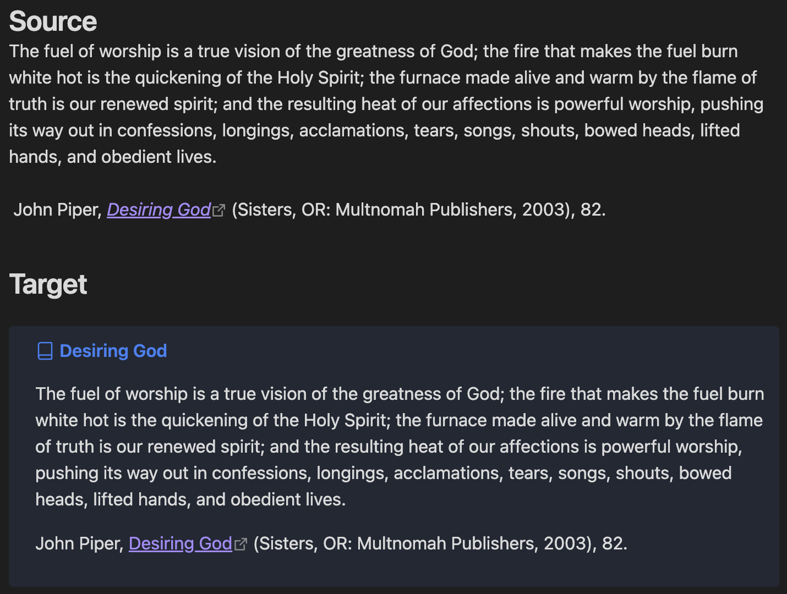

# Citation Callouts

An Obsidian plugin that formats quotes with citations from various sources into beautiful callouts.

## Features

- **Smart Book/Source Name Extraction**: Automatically extracts the source name from your citation
- **Rich Text Support**: Preserves formatting including bold, italic, and hyperlinks
- **Beautiful Callouts**: Creates formatted callouts with the book icon and extracted source name as the callout title
- **Multiple Access Methods**: Use command palette, ribbon icon, or keyboard shortcut
- **Works with Multiple Sources**: Designed for Logos Bible Software but works with any properly formatted citations

## Installation

### From Obsidian Community Plugins

1. Open Obsidian Settings
2. Go to **Community Plugins** and ensure Safe Mode is **OFF**
3. Click **Browse** and search for "Citation Callouts"
4. Click **Install** and then **Enable**

*This plugin is available in the official Obsidian Community Plugin directory.*

## Usage

**Note**: This plugin was originally designed for Logos Bible Software but works with any citation that includes a source reference.

1. Copy content that includes a citation with a URL or source reference
2. In Obsidian, use one of these methods:
   - **Command Palette**: Press `Ctrl/Cmd + P` and search for "Paste as Citation Callout"
   - **Ribbon Icon**: Click the book icon in the left sidebar
   - **Keyboard Shortcut**: Assign a custom shortcut in Settings → Hotkeys

### Example


**From Logos (copied to clipboard):**
```
The fuel of worship is a true vision of the greatness of God; the fire that makes the fuel burn white hot is the quickening of the Holy Spirit; the furnace made alive and warm by the flame of truth is our renewed spirit; and the resulting heat of our affections is powerful worship, pushing its way out in confessions, longings, acclamations, tears, songs, shouts, bowed heads, lifted hands, and obedient lives.

John Piper, [_Desiring God_](https://ref.ly/logosres/desiringgod?ref=Page.p+82&off=1501&ctx=mplete+our+picture.+~The+fuel+of+worship+) (Sisters, OR: Multnomah Publishers, 2003), 82.
```

**Pasted as Citation Callout:**
```markdown
> [!Citation] Desiring God
> The fuel of worship is a true vision of the greatness of God; the fire that makes the fuel burn white hot is the quickening of the Holy Spirit; the furnace made alive and warm by the flame of truth is our renewed spirit; and the resulting heat of our affections is powerful worship, pushing its way out in confessions, longings, acclamations, tears, songs, shouts, bowed heads, lifted hands, and obedient lives.
> 
> John Piper, [_Desiring God_](https://ref.ly/logosres/desiringgod?ref=Page.p+82&off=1501&ctx=mplete+our+picture.+~The+fuel+of+worship+) (Sisters, OR: Multnomah Publishers, 2003), 82.
```

## Requirements

- Obsidian v0.15.0 or higher
- Content with proper citation formatting for best results

## Development

### Setup

1. Clone this repository into your vault's plugins folder:
   ```bash
   cd /path/to/your/vault/.obsidian/plugins/
   git clone https://github.com/Marvive/Citation-Callouts.git
   ```

2. Install dependencies:
   ```bash
   cd Citation-Callouts
   npm install
   ```

3. Build the plugin:
   ```bash
   npm run build
   ```

4. Enable the plugin in Obsidian

### Scripts

- `npm run dev`: Start development with file watching
- `npm run build`: Build for production
- `npm run version`: Bump version and update files

## Support

If you encounter any issues or have feature requests, please [create an issue](https://github.com/Marvive/Citation-Callouts/issues) on GitHub.

## Contributing

Contributions are welcome! Please feel free to submit a Pull Request.

## Author

**Michael Marvive** - [GitHub Profile](https://github.com/Marvive)

## License

MIT License

---

*This plugin works best with properly formatted citations that include source references or URLs.* 
